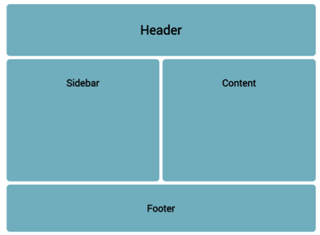
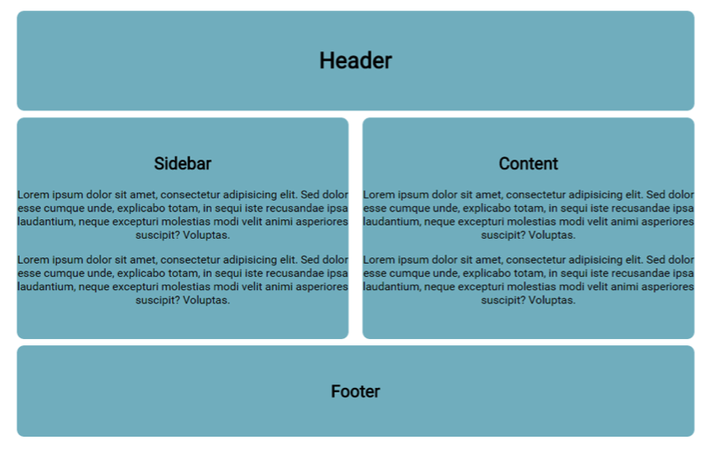
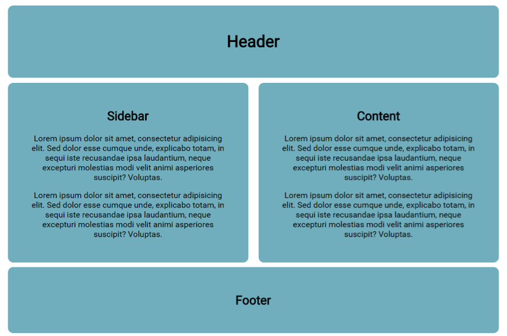

# Challenge: Border Box

Let’s continue with the code from the last lesson and apply **border-box**
 

**1-**  Add two paragraphs of placeholder text to the _sidebar_ and _content_ boxes.  

**2-**  Notice the lack of padding on the left 
and right.

**3-**  Add padding of `40px` to the left and right of the sidebar using longhand notation.

**4-**  Now you must recalculate the width for _sidebar_ and _content_ or use _border-box_.

**5-**  make the _sidebar_ a _border-box_; (see notes)  

**6-**  Apply the same to the _content_ div
 

Try adding a border to _sidebar_ and _content_.

Border-box is very useful!
