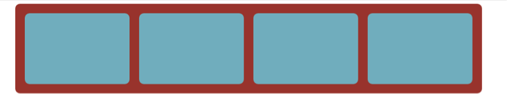
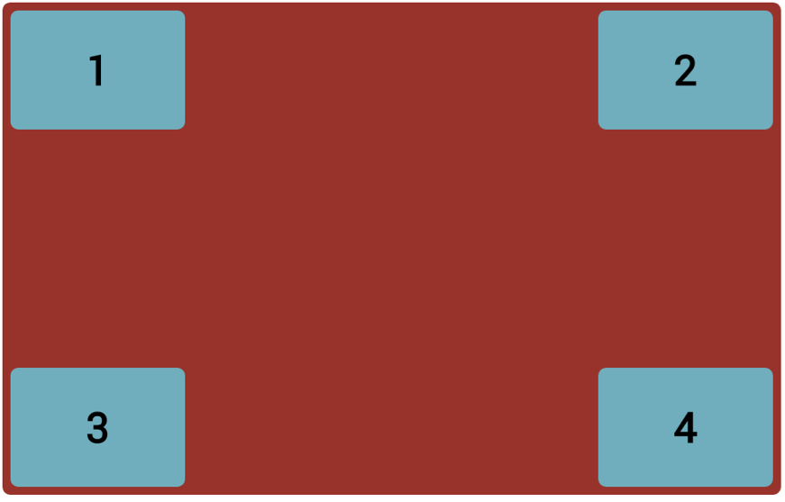
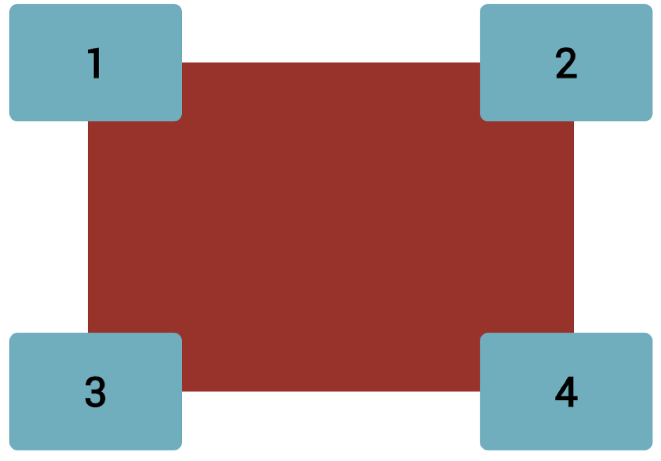
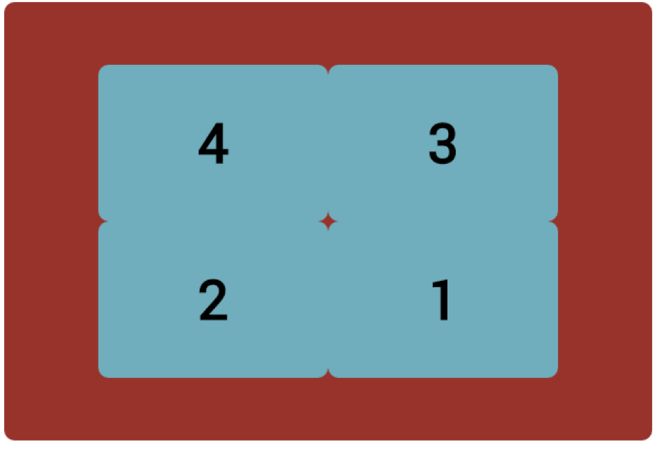
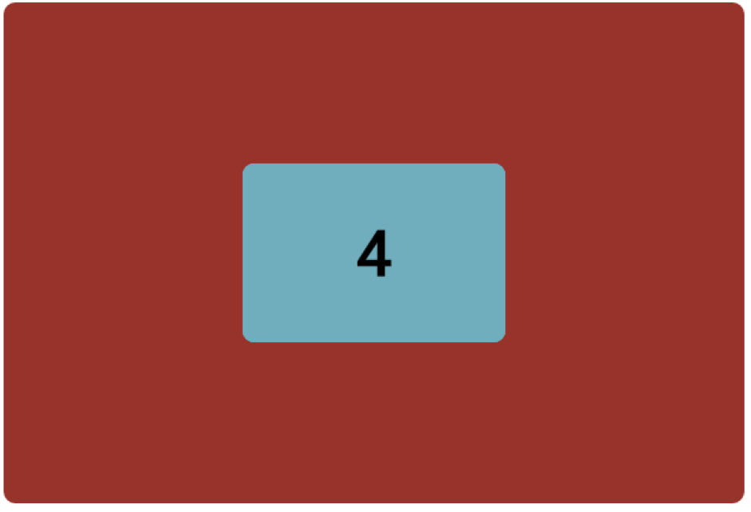

# Challenge: Positioning Flow

Alter the code from yesterday's walkthrough

Create the below layouts:

  

**Hint:** you might need to  change the position of container to achieve the second layout

  

Resize the container to 600px x 400px
  
  
  
  
  
Overlapping
 
  

