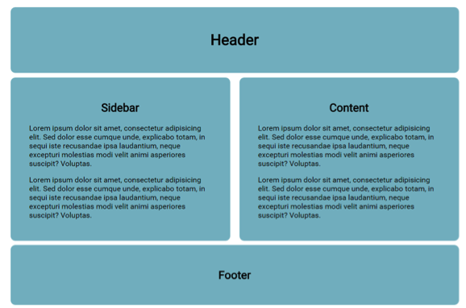
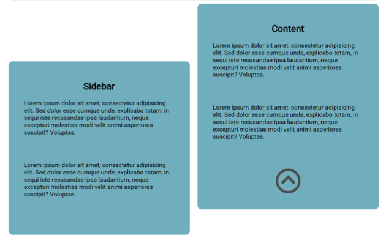
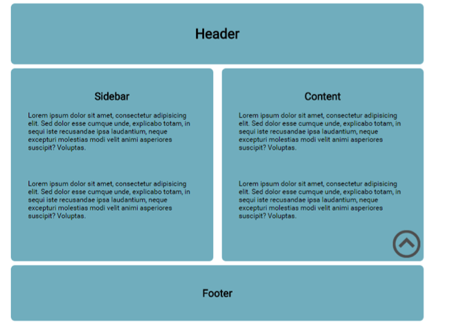
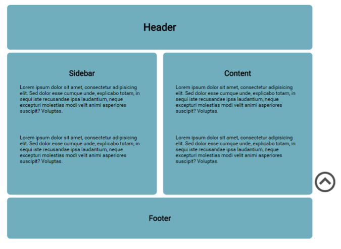
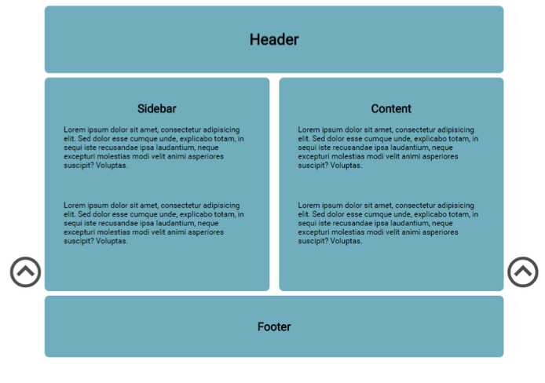

# Challenge: Absolute Positioning

Continuing from the final challenge in the previous lesson, we are going to add a link-to-top image to the bottom right of the content div.



**1-**  Remove the _borders_ and left align the paragraphs (optional).

**2-**  Place the image (located in this lessons _image_ folder) after the final paragraph _closing_ tag in content _div_.

> Note: [Syntax of the `img` tag](https://developer.mozilla.org/en-US/docs/Web/HTML/Element/img#Example_1)

**3-**  Give the image an _id_ of _linkToTop_ and we can give all paragraphs a _bottom margin_ of 50px to make room for the image.



**4-**  This is the most important step! Change the position of content to _relative_ and linkToTop to _absolute_.

**5-**  Notice how the element is now removed from the normal flow of the page. Now we can offset it where we like in relation to the content _div_.

**6-**  Place the linkToTop on the bottom right of content.

```css
    bottom: 0px;
    right: 0px;   /*experiment with other values*/
```




**7-**  From here we can offset the image if we wish. This example shows the offset is to the right with a minus value which will place it outside the content box.

```css
    right: -80px; /**/
```



**8-**  For practice add another element to the left of the sidebar. It should have its own _id_ (`#sideLinkToTop)


