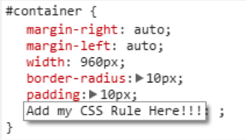
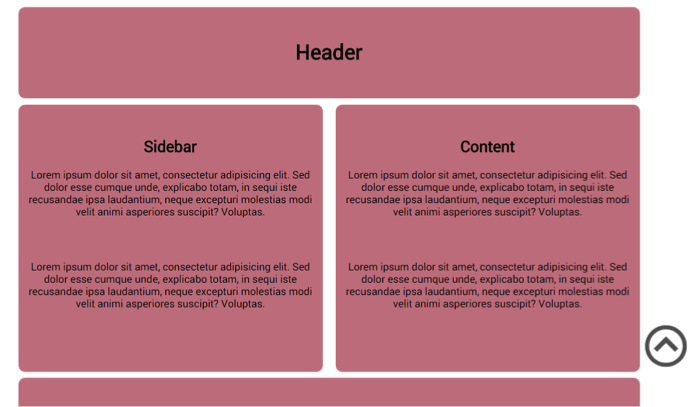
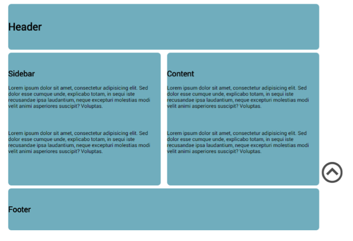
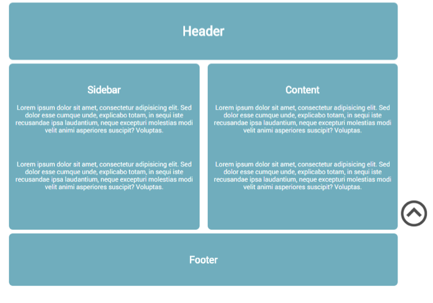

##Challenge: Developer Tools

Open up **Developer Tools** in Chrome.  
Using your new toolbox select HTML elements and alter their CSS rules in the browser.  
Try refreshing the page (shortcut **F5**)  

You can also add new CSS rules !!

Try and replicate the following:  

  
_Change Background Color  _
  
  
_Change  text alignment  _
  
  
_Add a color property to change the font color.  _
  
See what else you can do!!  
Remember none of your changes are saved when using Chrome Developer tools.  
Go to a website you use often (maybe wikipedia) open Developer Tools and change the layout as you see fit.
